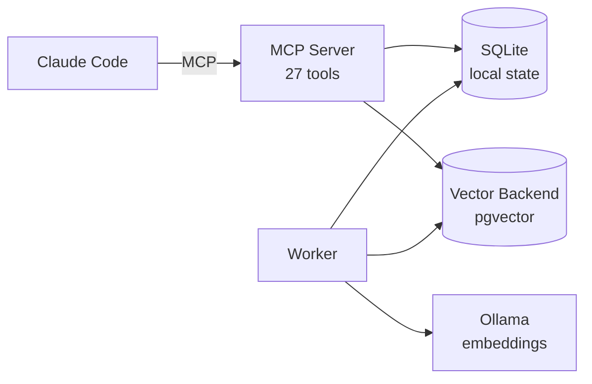

# Ragnest

Multi-knowledge-base RAG system with MCP integration for Claude Code.

## Architecture



**Two-layer storage:**
- **SQLite** (local, zero-config) — KB configs, documents, batches, queue, watch paths
- **Vector backends** (portable, per-KB) — chunks with embeddings + inline metadata. Any external system can query these directly.

**Claude Code** controls everything via MCP — create KBs, configure watch paths, queue files, search, monitor jobs.

**Worker** runs on a schedule or on-demand. Scans watched directories, embeds files via Ollama, stores vectors. Per-file commits for resilience.

## Features

- **Multiple knowledge bases**, each with its own embedding model, chunk settings, and vector backend
- **Per-KB backend selection** — route different KBs to different databases
- **External KB support** — connect to remote vector stores in read-only or read-write mode
- **Watch paths with file filtering** — point at a folder with glob patterns (e.g. `*.py,*.md`)
- **Quick init** — `init_kb` creates a KB, sets watch path, and triggers scan in one call
- **Batch tracking** — see progress, retry failures, undo entire batches
- **Resilient worker** — can be killed and restarted, picks up where it left off
- **File change detection** — re-ingests modified files automatically
- **Content deduplication** — skips identical content via SHA-256 hashing
- **Configurable retrieval** — threshold filtering, per-KB search, cross-KB search
- **System monitoring** — DB health, queue depth, worker status, available models
- **Export** — Parquet or JSON with model metadata sidecar
- **SQLite local state** — zero-config, works offline, no server dependency for state management

## MCP Tools

| Category | Tools |
|---|---|
| **Search & Retrieval** | `search_kb`, `search_all_kbs`, `get_similar_documents` |
| **KB Lifecycle** | `list_kbs`, `create_kb`, `update_kb`, `delete_kb`, `init_kb` |
| **Watch Paths** | `add_watch_path`, `remove_watch_path`, `list_watch_paths`, `pause_watch_path`, `resume_watch_path` |
| **Ingestion** | `add_file`, `add_directory`, `add_text` |
| **Batch & Worker** | `batch_status`, `list_batches`, `undo_batch`, `worker_status`, `trigger_scan` |
| **Documents** | `list_documents`, `delete_document` |
| **System** | `db_status`, `list_models`, `system_info` |
| **Export** | `export_knowledge_base` |

## Quick Start

```bash
# 1. Install
make install

# 2. Start Postgres (pgvector)
docker compose up -d

# 3. Configure
cp config.example.yaml config.yaml
# Edit config.yaml with your database host/port/name
# Create .env with secrets:
#   RAGNEST_DATABASE__USER=ragnest
#   RAGNEST_DATABASE__PASSWORD=yourpassword

# 4. Install Ollama and pull an embedding model
brew install ollama && brew services start ollama
ollama pull bge-m3

# 5. Add MCP server to Claude Code
claude mcp add ragnest -s user -- /path/to/ragnest/.venv/bin/python -m ragnest.mcp.server
```

Database and schema are auto-initialized when the MCP server starts.

## Usage Examples

**Initialize a KB from a folder:**
```
init_kb("my_docs", "/path/to/docs", "bge-m3", file_patterns="*.py,*.md")
→ Creates KB, sets watch path with filter, ready for worker
```

**Run the worker to embed queued files:**
```bash
python -m ragnest.cli.worker --scan --kb my_docs
```

**Search across all KBs:**
```
search_all_kbs("how does authentication work", top_k_per_kb=3)
→ Returns ranked results with source filenames and scores
```

**Check system health:**
```
system_info()
→ SQLite state, vector backends, Ollama connection, available models
```

## Configuration

```yaml
# config.yaml — no secrets here
database:
  host: localhost
  port: 5433
  name: ragnest

ollama:
  base_url: http://localhost:11434

defaults:
  chunk_size: 1000
  chunk_overlap: 200
```

```bash
# .env — secrets only
RAGNEST_DATABASE__USER=ragnest
RAGNEST_DATABASE__PASSWORD=yourpassword
```

Advanced: named backends for per-KB routing:
```yaml
databases:
  local:
    host: localhost
    port: 5433
    name: ragnest
  cloud:
    host: xyz.supabase.co
    port: 5432
    name: postgres
```

## Worker Usage

```bash
python -m ragnest.cli.worker --scan              # Scan watch paths + process queue
python -m ragnest.cli.worker --scan --kb my_docs  # Specific KB only
python -m ragnest.cli.worker --retry              # Retry failed files
python -m ragnest.cli.worker --scan --dry-run     # Preview what would be queued
```

## Development

```bash
make install          # Install editable + dev tools
make lint             # Ruff check + format check
make format           # Auto-fix lint + format
make typecheck        # mypy + basedpyright (strict)
make test             # All tests
make test-unit        # Unit tests only
```

## Project Structure

```
ragnest/
├── pyproject.toml
├── Makefile
├── docker-compose.yml          # Postgres + pgvector
├── config.example.yaml
├── src/ragnest/
│   ├── app.py                  # Application container + BackendRegistry
│   ├── config.py               # Pydantic Settings + YAML loader
│   ├── exceptions.py           # Custom exception hierarchy
│   ├── log.py                  # Structured logging
│   ├── models/
│   │   ├── domain.py           # Pydantic domain models
│   │   └── db.py               # DB row models
│   ├── db/
│   │   ├── backend.py          # DatabaseBackend protocol
│   │   ├── backends/
│   │   │   ├── postgres.py     # PostgreSQL + pgvector
│   │   │   └── sqlite.py       # SQLite for local state
│   │   ├── repositories/       # Data access layer (6 repos)
│   │   ├── schema.py           # Vector DDL + index management
│   │   └── sqlite_schema.py    # SQLite state DDL
│   ├── services/
│   │   ├── kb_service.py       # KB operations, search
│   │   ├── embedding_service.py # Embedding provider abstraction
│   │   ├── ingest_service.py   # Queue management
│   │   ├── worker_service.py   # Background processor
│   │   ├── export_service.py   # Export to Parquet/JSON
│   │   ├── system_service.py   # DB health, model listing
│   │   └── file_reader.py      # File parsing (PDF, text, code)
│   ├── mcp/
│   │   ├── server.py           # FastMCP app factory
│   │   ├── formatting.py       # Response formatters
│   │   └── tools/              # 8 tool modules (27 tools)
│   └── cli/                    # CLI entrypoints (worker, db_setup)
├── deploy/                     # launchd/systemd service files
└── tests/                      # pytest suite (113 tests)
```
